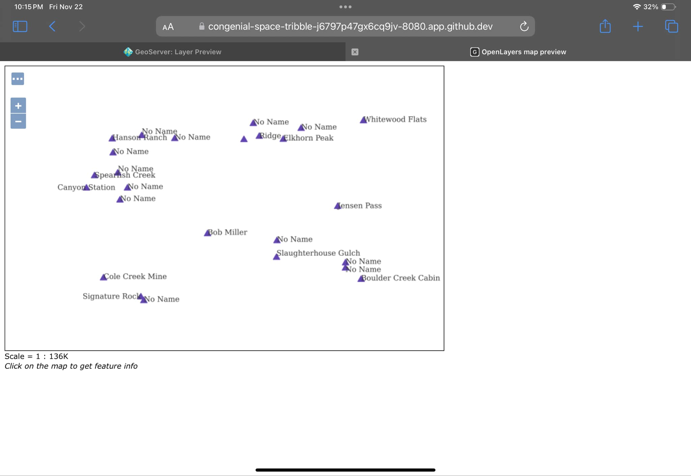
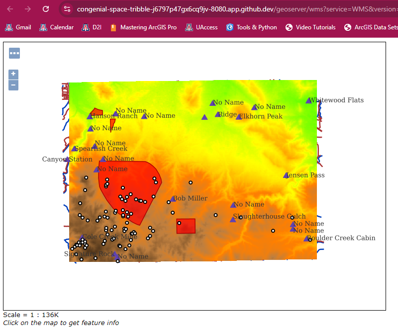

#### Q1: What is the URL of the WMS GetCapabilities request?
https://congenial-space-tribble-j6797p47gx6cq9jv-8080.app.github.dev/geoserver/ows?service=WMS&version=1.3.0&request=GetCapabilities
#### Q2: What is the URL of the WFS GetCapabilities request?
https://congenial-space-tribble-j6797p47gx6cq9jv-8080.app.github.dev/geoserver/ows?service=WFS&acceptversions=2.0.0&request=GetCapabilities
#### Q3: Submit a screenshot of your updated WFS Layer Preview
This only worked in Safari on my iPad. Chrome and Edge did not work on a Windows 10 PC and Apple discontinued Safari for Windows.

#### Q4: What does drawing order refer to? Which layer goes on `top`, the first or the last layer in the list?
Drawing order is the order in which the layers are drawn. The first layer listed in the group on GeoServer is the first one drawn on the bottom, each subsequent layer is drawn on top of the previous so the last layer in the list is drawn on top. 

#### Q5: Submit a screenshot of the Layer Preview of the Spearfish Layer Group when sf:sfdem is listed as the 3rd layer.
Still had trouble with this one in Chrome, with this error: Access to congenial-space-tribble-j6797p47gx6cq9jv-8080.app.github.dev was denied. You don't have authorization to view this page.

Eventually just kept clicking Save until it decided to work.

#### Q6: What is the WMS url for the single-tiled request?

https://congenial-space-tribble-j6797p47gx6cq9jv-8080.app.github.dev/geoserver/wms?SERVICE=WMS&VERSION=1.1.1&REQUEST=GetMap&FORMAT=image%2Fpng&TRANSPARENT=true&STYLES&LAYERS=spearfish&exceptions=application%2Fvnd.ogc.se_inimage&SRS=EPSG%3A26713&WIDTH=1900&HEIGHT=1000&BBOX=581454.5506313252%2C4910849.614871802%2C617721.4945680173%2C4929937.480101639

#### Q7: What is the WMS url for one of the tiled requests? What is the image size?
https://congenial-space-tribble-j6797p47gx6cq9jv-8080.app.github.dev/geoserver/wms?SERVICE=WMS&VERSION=1.1.1&REQUEST=GetMap&FORMAT=image%2Fpng&TRANSPARENT=true&tiled=true&STYLES&LAYERS=spearfish&exceptions=application%2Fvnd.ogc.se_inimage&tilesOrigin=589425.9342365642%2C4913959.224611808&WIDTH=256&HEIGHT=256&SRS=EPSG%3A26713&BBOX=588822.4666100442%2C4918255.70658098%2C591265.7133594635%2C4920698.9533303995

256x256 pixels

#### Q8: What is the URL of your coarse resolution sample of a WMTS url? What level does this tile refer to? Notice the differences. What are some of the fields that are unique to this url?
https://congenial-space-tribble-j6797p47gx6cq9jv-8080.app.github.dev/geoserver/gwc/service/wmts?layer=spearfish&style=&tilematrixset=EPSG%3A4326&Service=WMTS&Request=GetTile&Version=1.0.0&Format=image%2Fpng&TileMatrix=EPSG%3A4326%3A12&TileCol=1734&TileRow=1037

In this URL, the TileMatrix shows the EPSG code for the WGS84 coordinate system at level 12 and the TileCol and TileRow refer to the tile matrix coordinate for each tile.

#### Q9: In the zoomed-out URL, what are the TileCol and TileRow?
TileCol=1734

TileRow=1037

#### Q10: In the zoomed-in URL, what are the TileCol and TileRow?
TileCol=444071

TileRow=265526

#### Q11: Why are they so different for the same location in the map?
At higher levels/more zoomed in there are more tiles that cover smaller areas so the tile col and row values are higher.

#### Q12: Is there a difference in the TileMatrix? %3A is an HTML encoding for a colon, `:`.What does the number after EPSG:4326 mean?
The number after the colon refers to the zoom level and is higher when zoomed farther in and means the area has been divided into more, but smaller tiles.