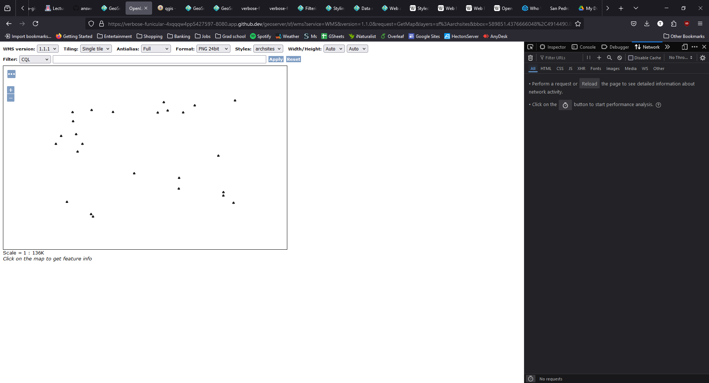
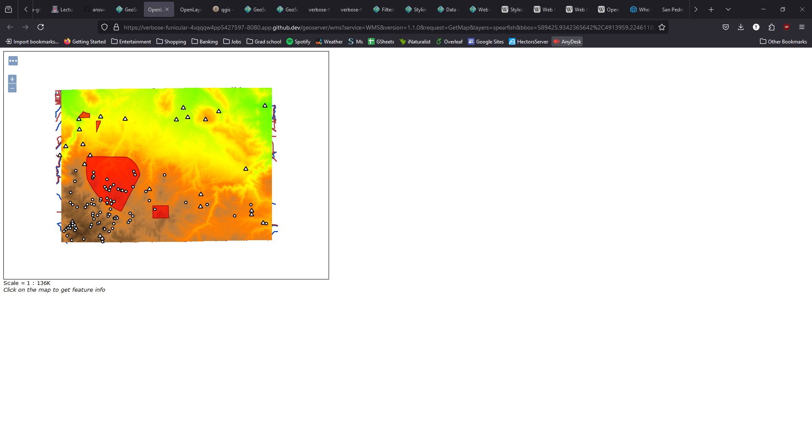

## UA GIST 604B - Open Source Geospatial
### Assignment 6-0-geoserver-intro
#### Travis Zalesky
#### 11/18/2024

1. What is the URL of the WMS GetCapabilities request?

    A. https://verbose-funicular-4xqqqw4pp5427597-8080.app.github.dev/geoserver/ows?service=WMS&version=1.3.0&request=GetCapabilities

2. What is the URL of the WFS GetCapabilities request?

    A. https://verbose-funicular-4xqqqw4pp5427597-8080.app.github.dev/geoserver/wfs?service=wfs&version=1.1.0&request=GetCapabilities

3. Submit a screenshot of your updated WFS Layer Preview

    A.
    

4. What does drawing order refer to? Which layer goes on top, the first or the last layer in the list?

    A. The order in which the layers are rendered, from top (first) down (last).  The last layer in the list is rendered on top of all other layers.

5. Submit a screenshot of the Layer Preview of the Spearfish Layer Group when sf:sfdem is listed as the 3rd layer.

    A.
    

6. What is the WMS url for the single-tiled request?

    A. https://verbose-funicular-4xqqqw4pp5427597-8080.app.github.dev/geoserver/wms?SERVICE=WMS&VERSION=1.1.1&REQUEST=GetMap&FORMAT=image%2Fpng&TRANSPARENT=true&STYLES&LAYERS=spearfish&exceptions=application%2Fvnd.ogc.se_inimage&SRS=EPSG%3A26713&WIDTH=769&HEIGHT=539&BBOX=584126.8517635025%2C4911288.635772089%2C613445.8127565337%2C4931865.354489854

7. What is the WMS url for one of the tiled requests? What is the image size?

    A. https://verbose-funicular-4xqqqw4pp5427597-8080.app.github.dev/geoserver/wms?SERVICE=WMS&VERSION=1.1.1&REQUEST=GetMap&FORMAT=image%2Fpng&TRANSPARENT=true&tiled=true&STYLES&LAYERS=spearfish&exceptions=application%2Fvnd.ogc.se_inimage&tilesOrigin=589425.9342365642%2C4913959.224611808&WIDTH=256&HEIGHT=256&SRS=EPSG%3A26713&BBOX=586379.2198606245%2C4915812.45983156%2C596152.2068583015%2C4925585.446829237

   The size of the image (tile) is 256px x 256px.

8. What is the URL of your coarse resolution sample of a WMTS url? What level does this tile refer to? Notice the differences. What are some of the fields that are unique to this url?

    A. https://verbose-funicular-4xqqqw4pp5427597-8080.app.github.dev/geoserver/gwc/service/wmts?layer=spearfish&style=&tilematrixset=EPSG%3A4326&Service=WMTS&Request=GetTile&Version=1.0.0&Format=image%2Fpng&TileMatrix=EPSG%3A4326%3A11&TileCol=864&TileRow=518

   The tile level is 11.

   TileCol and TileRow are uniqe to wmts request

9. In the zoomed-out URL, what are the TileCol and TileRow?

    A. TileCol = 864, TileRow = 518

10. In the zoomed-in URL, what are the TileCol and TileRow?

    A. TileCol = 3474, TileRow = 2072

11. Why are they so different for the same location in the map?

    A. The tile column and row variables are different at different zoom levels, because the image is divided into more tiles at a higher zoom level. Therefore there are more, smaller tiles which make up the whole image, and the tile col and row possitions must be recalculated at the increased level of zoom.

12. Is there a difference in the TileMatrix? %3A is an HTML encoding for a colon, :.What does the number after EPSG:4326 mean?

    A. Yes, the "number of divisions" is different in the TileMatrix at each zoom level. The number following the ":" in the TileMatirx value is the number of divisions which make up the tile matrix.
