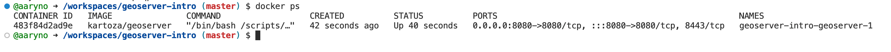

### Configuring codespace environment
In this assignment we are running a geoserver server instance in a docker container. The codespace is configured to automatically start up geoserver but we may need to get dirty with [Docker Compose](https://docs.docker.com/compose/) if something bad happens (i.e., geoserver crashes) and in future assignments working with WebGIS. Docker Compose is a feature of Docker that allows you to run multiple containers at once in an orchestrated way. While we won't be running multiple docker containers in this assignment, we will eventually be adding `postgis` and `leaflet` docker containers to this environment. Take a look at the `docker-compose.yml` file and note how it is similar but different than the `docker run...` command you used previously to bring up a `postgis` container.
```
version: "3.8"
services:
  geoserver:
    image: "kartoza/geoserver"
    ports:
      - "8080:8080"
    volumes:
      - /workspaces/geoserver-intro/geoserver_data/data_dir:/opt/geoserver/data_dir
    environment:
      - GEOSERVER_ADMIN_USER=admin
      - GEOSERVER_ADMIN_PASSWORD=geoserver
      - SAMPLE_DATA=true
      - HTTP_PROXY_NAME=${CODESPACE_NAME}-8080.preview.app.github.dev
      - HTTP_SCHEME=https
```
Essentially, it is the same as this command:
```
docker run  -p 8080:8080 -v /workspaces/geoserver-intro/geoserver_data/data_dir:/opt/geoserver/data_dir -e <...> kartoza/geoserver
```
which is really just running the `kartoza/geoserver` docker image ([source](https://github.com/kartoza/docker-geoserver)) with some environment variables not expanded above (the `<>` should be filled with `-e GEOSERVER...`, etc. flags from the `environment` section), a port mapping (`-p 8080:8080`), and a volume mapping (`-v /workspaces....`). That is pretty cumbersome to type so we are going to use the configuration of `docker-compose.yml` to save some of this tedium.

To confirm your geoserver container is running you can check the Docker Extension for VisualStudio or type in the terminal:
```
docker ps
```
You should have the `kartoza/geoserver` IMAGE running:


If not, then start it up. To start up your `geoserver` server:
```
docker compose up
```

The first few lines are like this:
```
@aaryno ➜ /workspaces/geoserver-intro (master) $ docker compose up
[+] Running 2/2
 ⠿ Container geoserver-intro-geoserver-1  Recreated                                                                                                                                                                        1.4s
 ⠿ Container geoserver-intro-postgis-1    Recreated                                                                                                                                                                        1.1s
Attaching to geoserver-intro-geoserver-1, geoserver-intro-postgis-1
geoserver-intro-geoserver-1  |  _  __          _                  ____             _             
geoserver-intro-geoserver-1  | | |/ /__ _ _ __| |_ ___ ______ _  |  _ \  ___   ___| | _____ _ __ 
geoserver-intro-geoserver-1  | | ' // _` | '__| __/ _ \_  / _` | | | | |/ _ \ / __| |/ / _ \ '__|
geoserver-intro-geoserver-1  | | . \ (_| | |  | || (_) / / (_| | | |_| | (_) | (__|   <  __/ |   
geoserver-intro-geoserver-1  | |_|\_\__,_|_|   \__\___/___\__,_| |____/ \___/ \___|_|\_\___|_|   
geoserver-intro-geoserver-1  |                                                                   
geoserver-intro-geoserver-1  |   ____           ____                           
geoserver-intro-geoserver-1  |  / ___| ___  ___/ ___|  ___ _ ____   _____ _ __ 
geoserver-intro-geoserver-1  | | |  _ / _ \/ _ \___ \ / _ \ '__\ \ / / _ \ '__|
geoserver-intro-geoserver-1  | | |_| |  __/ (_) |__) |  __/ |   \ V /  __/ |   
geoserver-intro-geoserver-1  |  \____|\___|\___/____/ \___|_|    \_/ \___|_|   
geoserver-intro-geoserver-1  |       
...                                          
```

It takes about 45 seconds to fully start up so be patient. You'll know it is running when you see `Server startup in [xxxx] milliseconds` like this:
```
...
geoserver-intro-geoserver-1  | 11-Nov-2022 23:37:48.798 INFO [main] org.apache.catalina.startup.HostConfig.deployDirectory Deploying web application directory [/usr/local/tomcat/webapps/ROOT]
geoserver-intro-geoserver-1  | 11-Nov-2022 23:37:48.824 INFO [main] org.apache.catalina.startup.HostConfig.deployDirectory Deployment of web application directory [/usr/local/tomcat/webapps/ROOT] has finished in [26] ms
geoserver-intro-geoserver-1  | 11-Nov-2022 23:37:48.847 INFO [main] org.apache.coyote.AbstractProtocol.start Starting ProtocolHandler ["http-nio-8080"]
geoserver-intro-geoserver-1  | 11-Nov-2022 23:37:48.903 INFO [main] org.apache.catalina.startup.Catalina.start Server startup in [46051] milliseconds
```

Note that running `docker compose up` like this will "lock up" your terminal and you will not be able to type. However, if you are having trouble with crashes it will be good to be able to see the output. You can always open anoter terminal by clicking on the "+" icon in the top right corner of the Terminal panel.